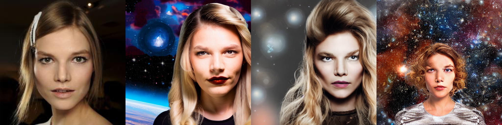
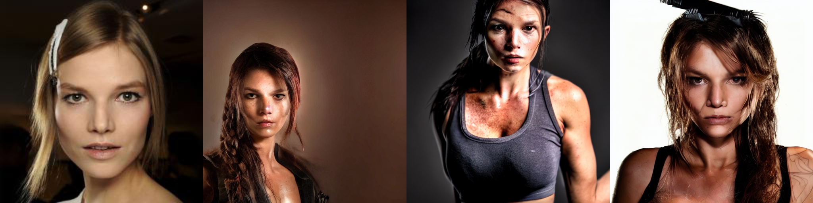
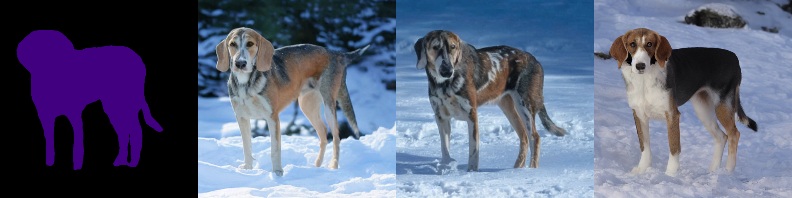
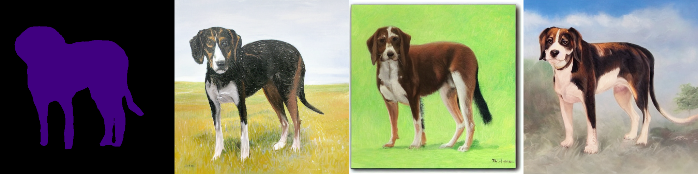
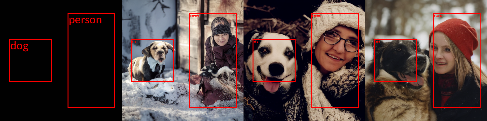
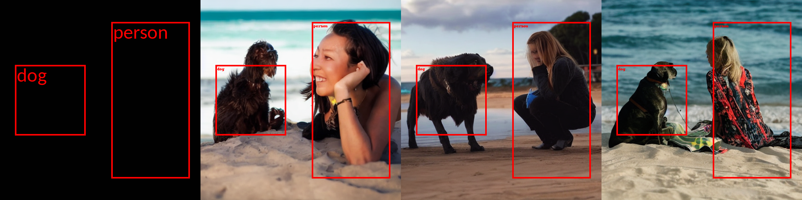
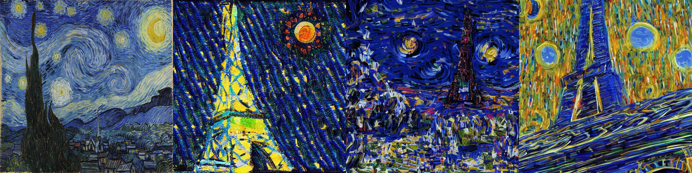
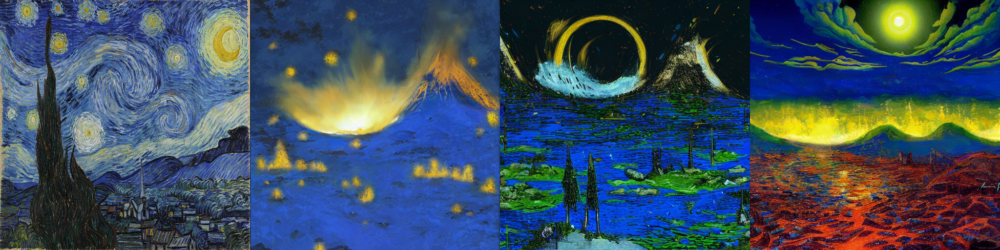
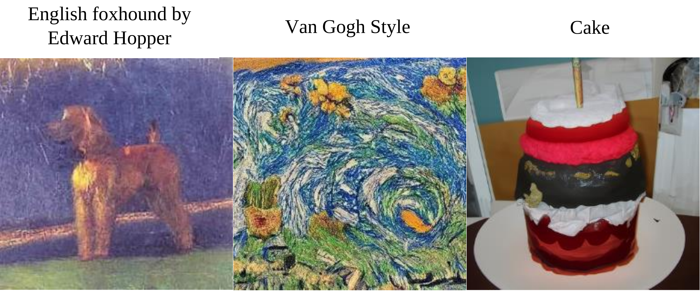

# Universal Guidance for Diffusion Models
</img>

The official PyTorch implementation of <a href="https://arxiv.org/abs/2302.07121">Universal Guidance for Diffusion Models</a>. 
This repository has python implementation of universal guidance algorithm that enables controlling diffusion models by arbitrary guidance modalities without the need to retrain any use-specific components.
Different guidance modalities we demonstrate are Human Identity, Segmentation Maps, Object Location, Image Style and Clip.
Our implementation is based on the text-to-img model from <a href="https://github.com/CompVis/stable-diffusion">Stable Diffusion</a> and Imagenet Diffusion Model from <a href="https://github.com/openai/guided-diffusion">OpenAI's guided diffusion</a>.


## Stable Diffusion
```
cd stable-diffusion-guided
```
The code for stable diffusion is in `stable-diffusion-guided`, and we use the `sd-v1-4.ckpt` checkpoint. Download this model and use its location in the scripts.


### Installations
```
conda env create -f environment.yaml
conda activate ldm
conda install pytorch torchvision cudatoolkit=11.3 -c pytorch
pip install GPUtil
pip install blobfile
pip install facenet-pytorch
```

For each of the guidance below, we can control the image generation by changing the following arguments. \
`--optim_original_conditioning` enables the original text conditioning \
`--optim_forward_guidance` enables the forward universal guidance \
`--optim_backward_guidance` enables the backward universal guidance \
`--ddim_steps` sets the number of diffusion steps involved \
`--optim_num_steps` sets the number of recurrent steps \
`--optim_forward_guidance_wt` sets the constant in s(t)

We now provide the arguments that produces our results for each of the guidance. For each guidance we show only for one of the guiding images but can easily be changed to others by changing the argument `--indexes`


### Face Recognition

In this we generate images conditioned on the text and guided by the face identity.  
The following script will take the human face from `./data/face_data/celeb/` and use it to guide the image generation conditioned on the given text prompt, set by `--text`
```
mkdir test_face
python scripts/face_detection.py --indexes 0 --text "Headshot of a person with blonde hair with space background" --optim_forward_guidance --fr_crop --optim_num_steps 2 --optim_forward_guidance_wt 20000 --optim_original_conditioning --ddim_steps 500 --optim_folder ./test_face/text_type_4/ --ckpt <Path to stable diffusion model>
python scripts/face_detection.py --indexes 0 --text "A headshot of a woman looking like a lara croft" --optim_forward_guidance --fr_crop --optim_num_steps 2 --optim_forward_guidance_wt 20000 --optim_original_conditioning --ddim_steps 500 --optim_folder ./test_face/text_type_11/ --ckpt <Path to stable diffusion model>
```

The above script will produce 20 images from which one can get the top k images based on face recognition models.
```
python scripts/face_top_k.py --folder ./test_face/text_type_4/ --img_index 0 --img_saved 20 --top_k 5
python scripts/face_top_k.py --folder ./test_face/text_type_11/ --img_index 0 --img_saved 20 --top_k 5
```

Some of the results produced for both the texts are as follows - the first image is the guiding image and rest are the generated images.

</img>
</img>


### Segmentation

In this we generate images conditioned on the text and guided by the segmentation map.  
The following script will take the images of dogs from `./data/segmentation_data/Walker/` to create the segmentation map. This segmentation map is then used to guide the image generation conditioned on the given text prompt, set by `--text`
```
mkdir test_segmentation
python scripts/segmentation.py --indexes 1 --text "Walker hound, Walker foxhound on snow" --scale 1.5 --optim_forward_guidance --optim_num_steps 10 --optim_forward_guidance_wt 400 --optim_original_conditioning --ddim_steps 500 --optim_folder ./test_segmentation/text_type_4/ --ckpt <Path to stable diffusion model>
python scripts/segmentation.py --indexes 1 --text "Walker hound, Walker foxhound as an oil painting" --scale 2.0 --optim_forward_guidance --optim_num_steps 10 --optim_forward_guidance_wt 400 --optim_original_conditioning --ddim_steps 500 --optim_folder ./test_segmentation/text_type_3/ --ckpt <Path to stable diffusion model>
```

Some of the results produced for both the texts are as follows - the first image is the guiding image and rest are the generated images.

</img>
</img>

### Object Detection

In this we generate images conditioned on the text and guided by the bounding boxes of different objects. 
The following script will take the first sample bounding boxe in `scripts/object_detection.py`. The bounding boxes are then used to guide the image generation conditioned on the given text prompt, set by `--text`
```
mkdir test_od
python scripts/object_detection.py --indexes 0 --text "a headshot of a woman with a dog" --scale 1.5 --optim_forward_guidance --optim_num_steps 5 --optim_forward_guidance_wt 100 --optim_original_conditioning --ddim_steps 250 --optim_folder ./test_od/ --ckpt <Path to stable diffusion model>
python scripts/object_detection.py --indexes 0 --text "a headshot of a woman with a dog on beach" --scale 1.5 --optim_forward_guidance --optim_num_steps 5 --optim_forward_guidance_wt 100 --optim_original_conditioning --ddim_steps 250 --optim_folder ./test_od/ --ckpt <Path to stable diffusion model>
```

Some of the results produced for both the texts are as follows - the first image shows the given boxes and rest are the generated images.

</img>
</img>


### Style Transfer

In this we generate images conditioned on the text and guided by the target image style.  
The following script will take the styling images from `./data/style_folder/styles/` and use it to guide the image generation conditioned on the given text prompt, set by `--text`

```
mkdir test_segmentation
python scripts/style_transfer.py --indexes 0 --text "A colorful photo of a eiffel tower" --scale 3.0 --optim_forward_guidance --optim_num_steps 6 --optim_forward_guidance_wt 6 --optim_original_conditioning --ddim_steps 500 --optim_folder ./test_style/text_type_1/ --ckpt <Path to stable diffusion model>
python scripts/style_transfer.py --indexes 0 --text "A fantasy photo of volcanoes" --scale 3.0 --optim_forward_guidance --optim_num_steps 6 --optim_forward_guidance_wt 6 --optim_original_conditioning --ddim_steps 500 --optim_folder ./test_style/text_type_2/ --ckpt <Path to stable diffusion model>
```

Some of the results produced for both the texts are as follows - the first image is the guiding image and rest are the generated images.

</img>
</img>

## Imagenet Diffusion 

In this we show scripts that can be used to run the experiments for image generation trained on imagenet.

### Clip guided
In this one can use the text encoding from clip to guide image generation. This leads to diffusion model generating images which are either out-of-distribution as well. Make sure to download the diffusion model from <a href="https://github.com/openai/guided-diffusion">OpenAI's guided diffusion</a>.
```
python Guided/Clip_guided.py --trials 5 --samples_per_diffusion 2 --text "English foxhound by Edward Hopper" --optim_forward_guidance --optim_forward_guidance_wt 2.0 --optim_num_steps 10 --optim_folder ./Clip_btd_cake/ --batch_size 8 --attention_resolutions 32,16,8 --class_cond False --diffusion_steps 1000 --image_size 256 --learn_sigma True --noise_schedule linear --num_channels 256 --num_head_channels 64 --num_res_blocks 2 --resblock_updown True --use_fp16 False --use_scale_shift_norm True --model_path <Path to the unconditional diffusion model>
python Guided/Clip_guided.py --trials 5 --samples_per_diffusion 2 --text "Van Gogh Style" --optim_forward_guidance --optim_forward_guidance_wt 5.0 --optim_num_steps 5 --optim_folder ./Clip_btd_cake/ --batch_size 8 --attention_resolutions 32,16,8 --class_cond False --diffusion_steps 1000 --image_size 256 --learn_sigma True --noise_schedule linear --num_channels 256 --num_head_channels 64 --num_res_blocks 2 --resblock_updown True --use_fp16 False --use_scale_shift_norm True --model_path <Path to the unconditional diffusion model>
python Guided/Clip_guided.py --trials 5 --samples_per_diffusion 2 --text "Birthday Cake" --optim_forward_guidance --optim_forward_guidance_wt 2.0 --optim_num_steps 10 --optim_folder ./Clip_btd_cake/ --batch_size 8 --attention_resolutions 32,16,8 --class_cond False --diffusion_steps 1000 --image_size 256 --learn_sigma True --noise_schedule linear --num_channels 256 --num_head_channels 64 --num_res_blocks 2 --resblock_updown True --use_fp16 False --use_scale_shift_norm True --model_path <Path to the unconditional diffusion model>
```
</img>
